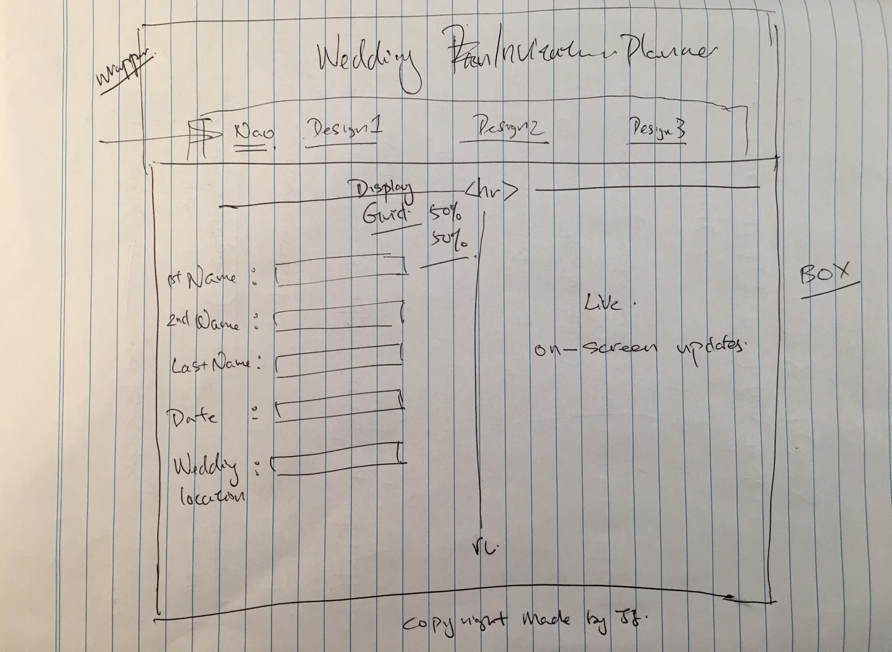

# Final-project

Objectives
- Build a site with HTML, CSS, and JavaScript
- Use JavaScript to create a functionable, demonstrable, presentable web application

##### Background 
Weddings. They're so stressful they often undermine the success of the endeavor they were meant to celebrate. We're going to help those newly-engaged by helping them face one of the big stressors: choosing an invitation format.

##### Requirements

1. Couples should be able to choose between 3 possible invitation styles. Upon selecting a design, the screen should instantly update with the new look-and-feel
2. Couples should be provided the appropriate input fields so that they can put in their vital data. Data, as it is entered, should appear inside the currently active look-and-feel.
3. If you can think of ways to improve user experience, please do so! Our stressed couples appreciate thoughtful user experience (UX) that helps soother their addled nerves and nervous bank accounts
4. Be Creative! If you want to corner the market on Goth-aesthetic invitations, DO IT. If you think that super-kawaii anime invitations are your fast-track to riches and wealth MAKE IT HAPPEN. Remember this goes in your portfolio. Make sure your work is authentic and true to you.

##### Non-Requirements

While you're going to use form input elements, you will not be submitting data to a remote server. You'll be using the power of JavaScript to do live, on-screen updates. Adding persistence will come in a later iteration ;).

---------------------------------------------------------------------------------------------------------------------------------------------------------------------------------
Wireframe 

Completed Project 

